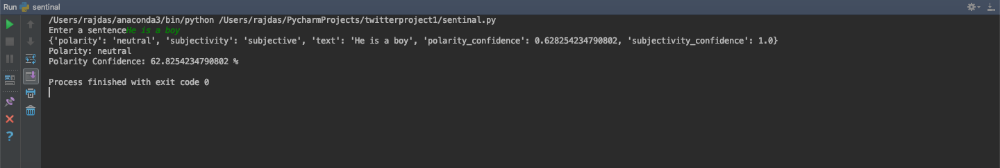
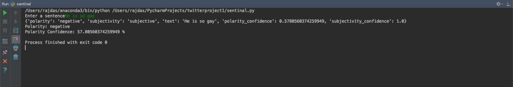
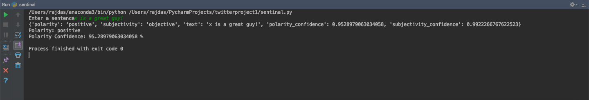

# Sentiment Analyser

Built using Python, it is a simple sentiment analyser built on the Aylien API. For the code to work properly, make sure you have the aylien-apiclient installed on the machine using pip. API keys are also very important for the project to run.

 ## Dependencies
  * Aylien API
  
`pip install aylien-apiclient`

 **Command format** 
 
 `python sentinal.py` 
 
 
 ### Sample output :
 1. Neutral:
 
 2. Negative:
 
 3. Positive:

